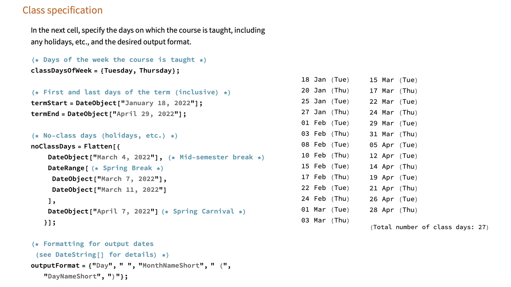

# course-days

Mathematica notebook for generating the list of class days for a given class.

**Input:**

- days of the week on which the class is taught (e.g., Tuesday/Thursday)
- start and end date of the class
- any holidays/no-class days
- the desired date formatting

**Output:**

- A list of class days, as formatted strings
- The total number of class days

